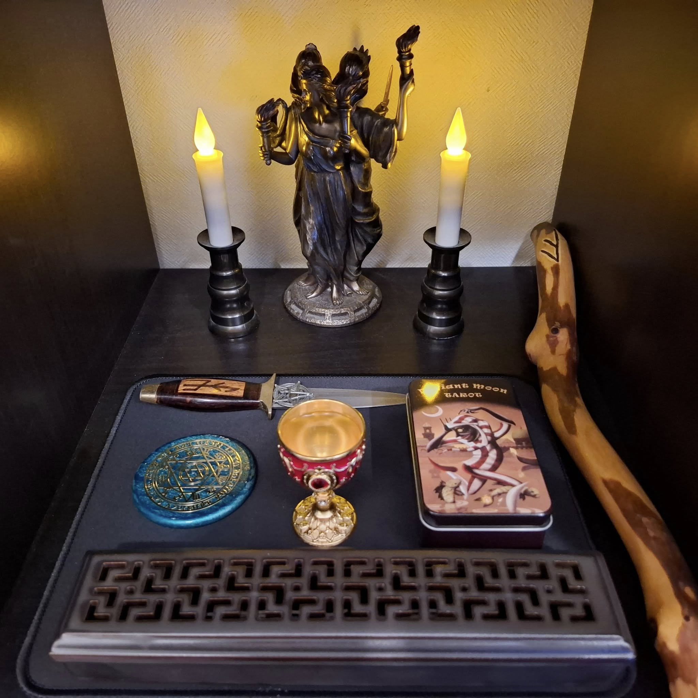

## 🔮 本棚神殿でのタロット聖別儀式 v0.1

### 【概要】
このプロトコルは、Deviant Moon Tarotをはじめとするカードデッキを、ヘカテ女神とのインターフェースとして聖別するための簡易儀式です。
ヘカテ神殿として設えた本棚神殿の前で、祈りの言葉を唱えることでカードとの繋がりを強化します。

---

### 1. 準備
- 本棚神殿の中央に、カードデッキを置く
- 使用するデッキが決まっていれば、その缶や箱も一緒に置いてよい

---

### 2. 祈りの言葉（音読）

> Hail Hekate, Keeper of the Keys, Goddess of Thresholds and Moonlit Paths,  
> I dedicate this Deviant Moon Tarot to you, whose eyes see the hidden,  
> Whose voice echoes in dreams and shadows.  
> May these cards speak with your clarity, whisper with your wisdom,  
> And reveal what lies beneath the mask of the world.  
> Guide my hand, guide my sight—  
> Through mystery, shadow, and moonlight.  
> So mote it be.

（訳：  
鍵の守護者、境界と月明かりの道の女神ヘカテよ、  
このDeviant Moonタロットを、あなたに捧げます。  
あなたの眼差しは隠されたものを見抜き、  
その声は夢と影の中に響きます。  
このカードがあなたの明晰さと知恵を語り、  
世界の仮面の裏側を映し出しますように。  
どうか、私の手と視線を導いてください。  
神秘と影と月光のなかを。  
そうあれかし。）

---

### 3. 終了とオプション
- カードを缶に戻しても、そのままでもよい（神棚や仏壇の供物のように、どのくらい置くかは自分で決めてよい）
- 儀式の前には日常の雰囲気のまま行うのではなく、呼吸を整え気持ちを整え、ご自分の信仰する神に全身全霊で向き合いましょう
- 電池式のろうそくを灯す、香を焚く、お鈴を鳴らすなどは好みに応じてご自由にどうぞ

---

## 🌙 本棚神殿の例（ヘカテ女神）
以下はDeviant Moon Tarotを本棚神殿で聖別している写真です：

---

🌀このプロトコルは「Open Source Witchcraft」プロジェクトの一環として公開されています。
非商用・クレジットありであれば、どなたでも自由に使用・改変・共有いただけます。
（ライセンス：CC BY-NC-SA）
